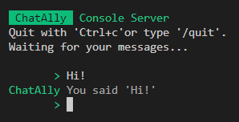

import { Card, CardGrid } from "@astrojs/starlight/components";

## Hosting your own chatbot is as easy as hosting an _Express.js_ application

If you are a web developer and know how to host a web application with Express and [node.js](https://nodejs.org), ChatAlly will only surprise you with it's ease of use.

You won't need to start from scratch and learn a new language with all of it's development environment. Build on the skills that you already have.

Install two npm packages...

```bash
npm install @chatally/core @chatally/console
```

...create one Javascript file...

```js
// index.js
import { Application } from '@chatally/core'
import { ConsoleServer } from '@chatally/console'

new Application({ log: false }) //
  .use(new ConsoleServer("ChatAlly"))
  .use(({ req, res }) => {
    if (res.isWritable) {
      res.write(`You said '${req.content}'`)
    }
  })
  .listen()
```

...and start chatting with your bot on the console



For a full example, see our [Getting Started](/guides/) guide.

## Integrate your chatbot with WhatsApp, Signal and AI without crazy hosting costs

<CardGrid stagger>
  <Card title="Modules" icon="module">
    ChatAlly is a minimal and flexible Node.js chat application framework that
    provides a robust set of features for your chatbot. It consists of a
    [collection of npm modules](https://www.npmjs.com/search?q=chatally) that
    make building your own self-hosted chatbots quick and easy.
  </Card>
  <Card title="Integration" icon="integration">
    Connect your chatbot to [WhatsApp](/reference/servers/whatsapp-cloud) or
    [Signal](/reference/servers/signal), so your users can communicate with
    your application easily. Use one of the many modules readily available.
    Create your own natural chat experience with open-source AI, e.g. with
    [TensorFlow.js](/reference/middleware/tensorflow) or other more dedicated
    chat frameworks like 
    [nlp.js](https://github.com/axa-group/nlp.js?tab=readme-ov-file#nlpjs).
  </Card>
  <Card title="Middleware" icon="middleware">
    It is also easy to build your own integration, e.g. for Huggingface's
    [transformers.js](https://huggingface.co/docs/transformers.js/en/index).
    Natural language processing is only one part, add a consent manager, log
    training data from real chats, integrate your knowledge base or speech
    features. If you can't find, what you need,
    [write your own middleware](/guides/middleware) easily.
  </Card>
  <Card title="Community" icon="community">
    Share your own middlware with others, get help from experienced users, share
    ideas for new features or fix a bug. Checkout our [Github
    project](https://github.com/orgs/chatally/projects/1/views/3) or join our
    [Discord server](https://discord.gg/Sb8ECsQCgr).
  </Card>
  <Card title="Documentation" icon="docs">
    ChatAlly gives you all the tools to [get started quickly](/guides) and
    evolve your chatbot into your very own support character for your users. To
    support you on your journey, documentation is essential, that is why it is
    an explicit work package in our project and will account for at least half
    of the effort. Check out our guides and [examples](/examples).
  </Card>
</CardGrid>

## Contribute to ChatAlly

All contributions are welcome: Join the community on
[Discord](https://discord.gg/Sb8ECsQCgr), provide feedback or bug fixes on
[Github](https://github.com/chatally/chatally/issues), provide more usage
examples, provide interesting middleware or another server (e.g. Telegram).

[About us](/about) | [Impressum](/impressum)
