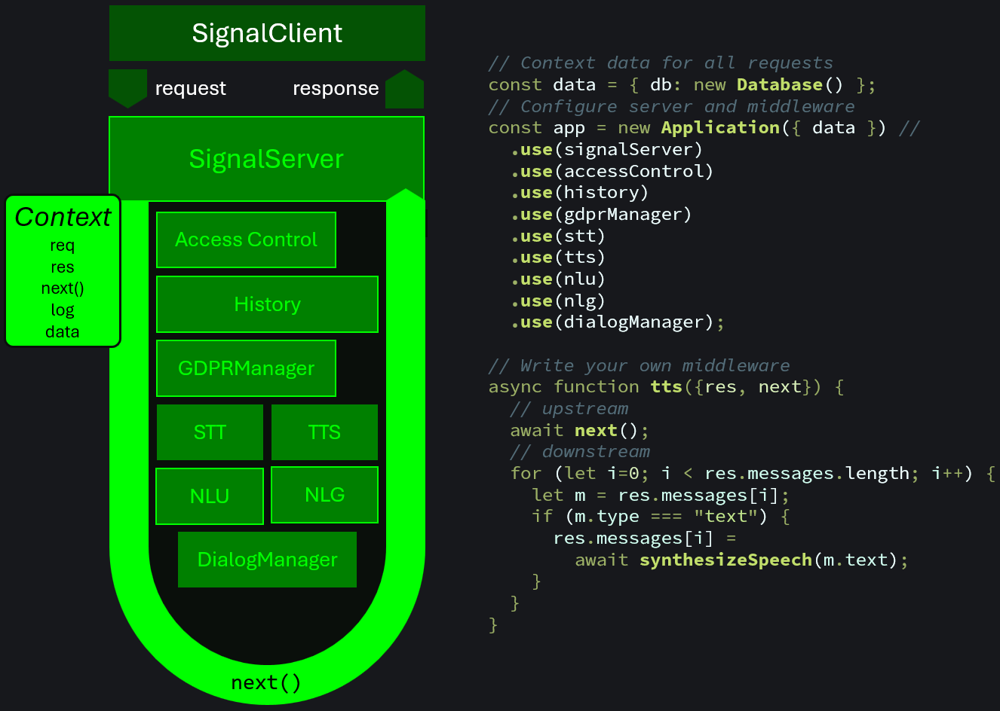

import ModuleLinks from '../../../../components/ModuleLinks.astro';

<ModuleLinks id="core" />

A web application starts off with an HTTP server that creates a request and an empty response object and hands it over to the application framework, e.g. Express or Koa to generate a response.

A ChatAlly chat application is very similar: It starts off with a chat server that creates a request and response object and hands it over to the ChatAlly application. The application dispatches it to all the middleware that should generate the response and returns it to the server to send it out to the user client.

The request handling flow translates directly into code.

**TLDR;**

If you want to get your fingers dirty quickly, go to the [Getting started](/guides) guide. Or check out any of the [examples](/examples).

## The Parts

The core consists of the following parts:

- The [Application](/reference/core/application) receives requests and dispatches them to all middleware. It provides error handling and logging.
- [Servers](/reference/core/servers) are the bridge to proprietary chat protocols and clients. They must allow registering the application as dispatcher and to be started by a call to `listen()`. Servers trigger the application on incoming messages and are responsible to deliver outgoing messages.
- [Middleware](/reference/core/middleware) is responsible to generate a response from a request, but you can also add passive middleware, e.g. to only log chats or trigger reactions in other systems, e.g. send out notifications to admins or middleware that just enriches the context.
- The [Context](/reference/core/context) passed to the middleware consists of the `Request`, the `Response`, a `next()` function allowing middlewares to do post-processing, a `log` handle to a child logger of the application and a `data` record to pass arbitrary data.
- Various types of [messages](/reference/core/messages) allow to interpret all kinds of incoming messages and generate rich outgoing message content. What types of messages are available depends very much on the kind of server used.
- Technically, the [logger facade](/reference/core/logger) comes in it's own package `@chatally/logger`, but conceptually it belongs to the core. It allows the application, servers and middleware to implement logging without tying them to a specific logging framework. It comes with a sensible default [`BaseLogger`](/reference/core/logger#baselogger), that logs to the console and can be used to implement your own adapter, e.g. for [Pino](https://github.com/pinojs/pino) or [Winston](https://github.com/winstonjs/winston).
- Finally, the [utils](/reference/core/utils) provide some handy utility functions that are used throughout the framework, but could come handy for you, too.

The following pages will give you detailed reference documentation of all modules.
